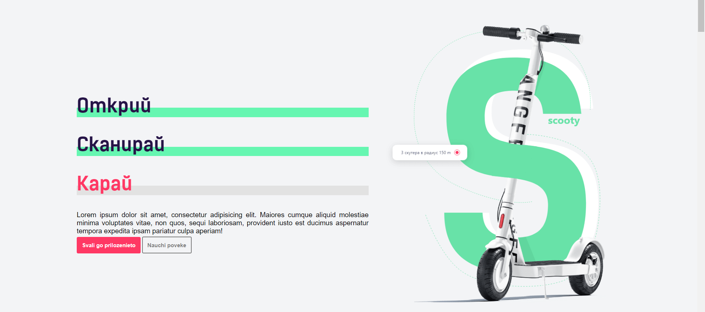

# Аз Мога - Тук и сега, Девин 2022

*National IT Competition for IT, Informatics and Visual Arts - Devin, 3-5 June, 2022*

The National IT Competition for IT, Informatics and Visual Arts is a national competition, held in Devin since 2011. The 2022 edition included 447 participants from all over the country, distributed in 8 categories:

* redesign of a website
* front-end development
* programming
* graphic design
* videoclip
* photography
* presentation
* game development

**It was my debut campaign.**

I have finished at the amazing 8th place in the category of **Front - End Development**.

# About the task

*Scooty - an app for f.ckin' scooters*

Our task was to build an app for hiring scooters, using HTML, CSS and JS, with Responsive design also being considered as a big plus.

I have managed to do almost complete website, with few small details missing. Albeit, I haven't implemented proper responsive design and I didn't use JavaScript.
